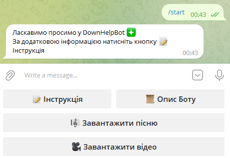
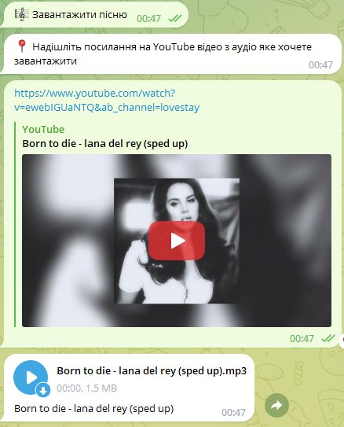
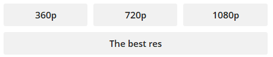
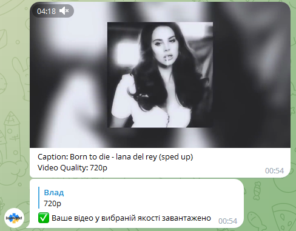

# DownHelpBot
---
The DownHelpBot is a Python-based utility 
designed to simplify the process of downloading 
small videos and audio files from YouTube. 
Whether you're a content creator in need of 
quick references or a media enthusiast collecting your favorite tracks, 
this bot is your go-to solution.
### Technology Stack: 
* Python
* aiogram
---
# Usage
* Find the @helpfulTask_bot in Telegram and enter command /start in chat

## Download the audio
* If you want to download audio, click on  and then just sent the YouTube link which audio you want get, and the bot send you the audio

## Download the video
* If you want to download video, click on  and then just sent the YouTube link which video you want get
* Then choose the resolution you want to download

* In the end bot sends you video

