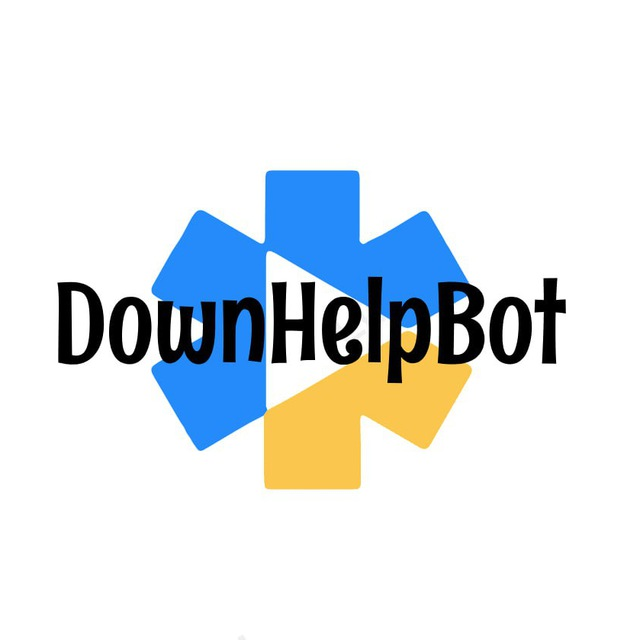

# DownHelpBot
---
### The DownHelpBot is a Python-based utility designed to simplify the process of downloading small videos and audio files from YouTube. Whether you're a content creator in need of quick references or a media enthusiast collecting your favorite tracks, this bot is your go-to solution.
### Technology Stack: 
* Python
* aiogram
